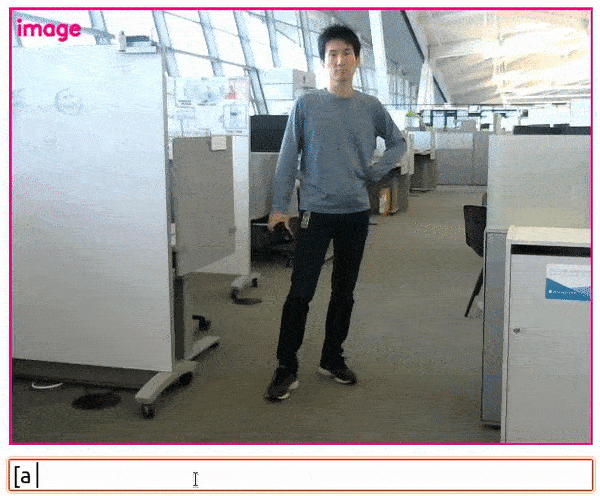
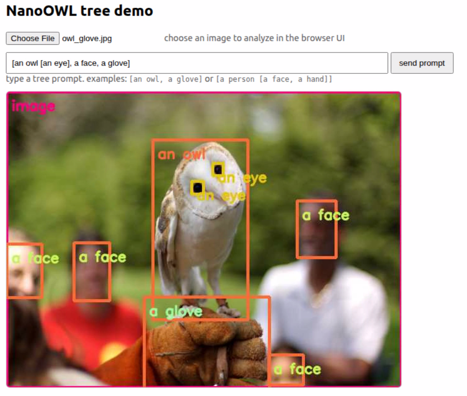
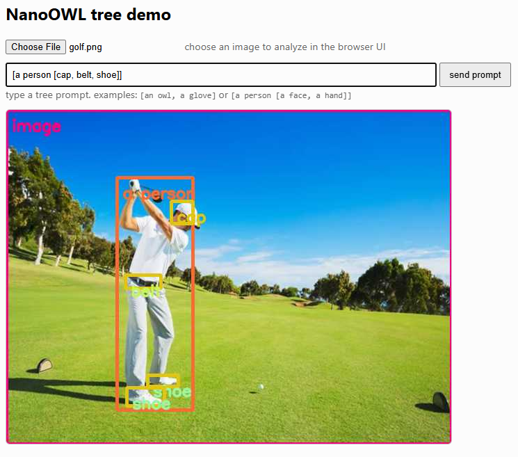
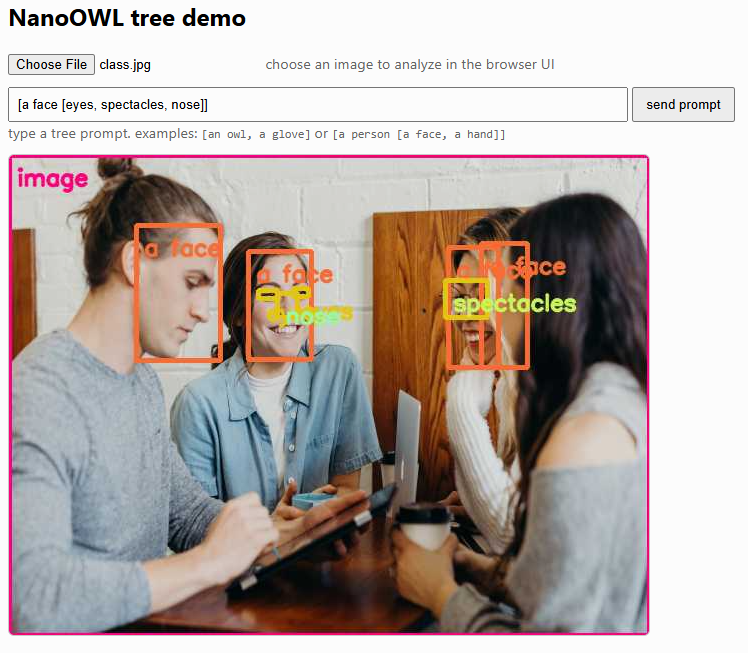

# Demo 1: Zero-Shot Object Detection - NanoOWL

NanoOWL is a project that optimizes OWL-ViT to run real-time on NVIDIA Jetson Orin Platforms with NVIDIA TensorRT. NanoOWL also introduces a new "tree detection" pipeline that combines OWL-ViT and CLIP to enable nested detection and classification of anything, at any level, simply by providing text.

<p align="center">
</p>

<details>
<summary>Resources</summary>

- Source code -  https://github.com/NVIDIA-AI-IOT/nanoowl
- Container - https://github.com/dusty-nv/jetson-containers/tree/master/packages/vit/nanoowl
- Docker Images - https://hub.docker.com/r/dustynv/nanoowl/tags

</details>

### Step 1: Launch NanoOWL Container

```bash
jetson-containers run \
    -v $HOME/Downloads/arrow_act_oct_2025/demos/demo1_zero_shot_object_detection:/mnt/host_files:ro \
    dustynv/nanoowl:r36.4.0
```

**Note:** Make sure to update the path to the demo directory in the `-v` flag. The `-v` flag mounts the demo directory as read-only (`ro`) inside the container at `/mnt/host_files`.

### Step 2: Install Dependencies
Inside the container, run the following commands
```bash
pip install aiohttp --index-url https://pypi.org/simple
```

- Install utility packages (for image viewing)

```bash
apt update && apt install sxiv -y
```

### Step 3: Run prediction

<details>
<summary><strong>Single image detection</strong></summary>

- Change directory
    ```bash
    cd /opt/nanoowl/examples
    ```

- Replace the `owl_predict.py` script with the updated version available [HERE](./owl_predict.py)
    - Copy it from the mounted directory:
        ```bash
        cp /mnt/host_files/owl_predict.py owl_predict.py
        ```
                
- Run this
    
    ```bash
    python3 owl_predict.py \
        --prompt="[an owl]" \
        --threshold=0.1 \
        --image_encoder_engine=../data/owl_image_encoder_patch32.engine \
        --output owl.jpg
    ```
    - Where
        - `--prompt` : specify the object(s) to detect in the image [<object1> [<subobject1>, <subobject2>], <object2>, ...]
        - `--threshold` : confidence threshold for detection
        - `--image_encoder_engine` : path to the TensorRT engine file for OWL-ViT image encoder
        - `--output` : path to save the output image with detected objects
    - Visualize the output image using image viewer (sxiv)
        
        ```python
        sxiv owl.jpg
        ```
    <details>
    <summary>More examples</summary>
    
    ```bash
    python3 owl_predict.py \
        --prompt="[a glove]" \
        --threshold=0.1 \
        --image_encoder_engine=../data/owl_image_encoder_patch32.engine \
        --output owl.jpg
    ```
    
    ```bash
    python3 owl_predict.py \
        --prompt="[an owl, a glove]" \
        --threshold=0.1 \
        --image_encoder_engine=../data/owl_image_encoder_patch32.engine \
        --output owl.jpg
    ```
    
    ```bash
    python3 owl_predict.py \
        --prompt="[a frog]" \
        --threshold=0.1 \
        --image_encoder_engine=../data/owl_image_encoder_patch32.engine \
        --image ../assets/frog.jpg \
        --output frog.jpg
    ```
    
    ```bash
    python3 owl_predict.py \
        --prompt="[a spectacle]" \
        --threshold=0.1 \
        --image_encoder_engine=../data/owl_image_encoder_patch32.engine \
        --image ../assets/class.jpg \
        --output class.jpg
    ```
    
    ```bash
    python3 owl_predict.py \
        --prompt="[a face]" \
        --threshold=0.1 \
        --image_encoder_engine=../data/owl_image_encoder_patch32.engine \
        --image ../assets/class.jpg \
        --output class.jpg
    ```
    
    ```bash
    python3 owl_predict.py \
        --prompt="[a face, a spectacle]" \
        --threshold=0.1 \
        --image_encoder_engine=../data/owl_image_encoder_patch32.engine \
        --image ../assets/class.jpg \
        --output class.jpg
    ```
    </details>
</details>

<details>
<summary><strong>Interactive detection</strong></summary>


- Change directory

    ```bash
    cd /opt/nanoowl/examples/tree_demo
    ```

    <details>            
    <summary><strong>Option 1: Live camera feed</strong></summary>

    - Ensure camera device available
            
        ```bash
        ls /dev/video*
        ```
            
        <details>
        <summary>Extra</summary>

        - Check supported formats, resolutions, and framerates using
            
            ```python
            sudo apt install v4l-utils && v4l2-ctl --list-formats-ext -d /dev/video0
            ```
            
        - View the camera feed using gstreamer
            
            ```python
            gst-launch-1.0 v4l2src device=/dev/video0 ! videoconvert ! autovideosink
            ```
            
            - Or using OpenCV
                
                ```python
                python3 - <<'EOF'
                import cv2
                cap = cv2.VideoCapture(0)
                if not cap.isOpened():
                    print("Cannot open camera")
                    exit()
                while True:
                    ret, frame = cap.read()
                    if not ret:
                        print("Can't receive frame (stream end?). Exiting ...")
                        break
                    cv2.imshow("USB Camera", frame)
                    if cv2.waitKey(1) & 0xFF == 27:  # Press ESC to quit
                        break
                cap.release()
                cv2.destroyAllWindows()
                EOF
                ```
        </details>
                        
    - Launch the demo
        
        ```python
        python3 tree_demo.py --camera 0 --resolution 640x480 \
            ../../data/owl_image_encoder_patch32.engine
        ```
        
    - Open a web browser
        - Go to `0.0.0.0:7860`
        - You should see a live camera feed in your browser
        - Type object names and see the live detection on the camera feed

    </details>
    <details>
    <summary><strong>Option 2: Static images upload</strong></summary>

    - Replace the `tree_demo.py` script with the updated version available [HERE](./tree_demo.py)
        - Copy it from the mounted directory:
            ```bash
            cp /mnt/host_files/tree_demo.py tree_demo.py
            ```
    - Replace the `index.html` file with the updated version available [HERE](./index.html)
        - Copy it from the mounted directory:
            ```bash
            cp /mnt/host_files/index.html index.html
            ```
                
    - Run this
        
        ```bash
        python3 tree_demo.py ../../data/owl_image_encoder_patch32.engine --camera -1 --resolution 640x480 --port 7860
        ```
        - Where
            - `--camera -1` : disables camera input and enables image upload option in the web interface
            - `--resolution 640x480` : resolution for processing images
            - `--port 7860` : port number for the web interface

    - Open a web browser
        - Go to `0.0.0.0:7860`
        - You should see an option to upload images
        - Upload any image
        - Type object names in the prompt box and see the detection results
    
    - Try the following images and prompts
        - owl.png: `[an owl [an eye], a face, a glove]`
        - golf.png: `[a person [belt, cap, shoe]]`
        - class.jpg: `[a face [eyes, spectacles, nose]]`
    - OUTPUT
        
        
        
        
        
        
    </details>

</details>
