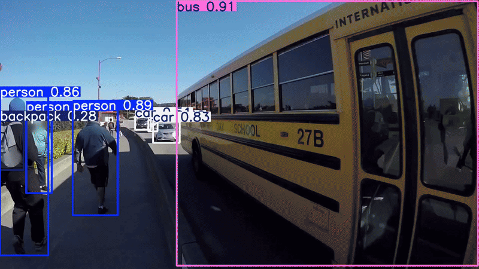
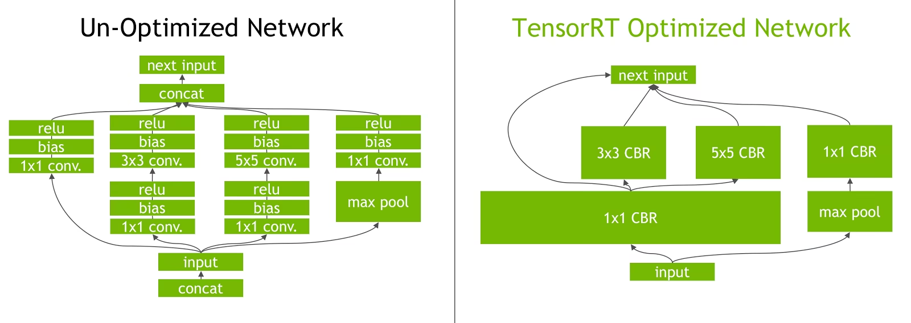

# Demo 4: Object detection with TensorRT

This demo demonstrates object detection using YOLOv11 with TensorRT optimization on Jetson devices.

**NOTE:** This is for demonstration purposes only. For production deployment, please refer to the official Ultralytics documentation and its license.

<p align="center">
</p>

<details>
<summary>Resources</summary>

- Source - https://www.jetson-ai-lab.com/tutorial_ultralytics.html
- Ultralytics YOLOv11 - https://docs.ultralytics.com/guides/nvidia-jetson/#quick-start-with-docker
<details>
<summary><strong>Advanced: TensorRT Optimization Details</strong></summary>
    
- **Layer Fusion:** The TensorRT optimization process includes layer fusion, where multiple layers of a neural network are combined into a single operation. This reduces computational overhead and improves inference speed by minimizing memory access and computation.

    

- **Dynamic Tensor Memory Management**: TensorRT efficiently manages tensor memory usage during inference, reducing memory overhead and optimizing memory allocation. This results in more efficient GPU memory utilization.
- **Automatic Kernel Tuning**: TensorRT applies automatic kernel tuning to select the most optimized GPU kernel for each layer of the model. This adaptive approach ensures that the model takes full advantage of the GPUs computational power.

</details>
</details>

## Step 1: Launch Ultralytics container
    
```bash
sudo docker run -it --rm \
    --ipc=host \
    --runtime=nvidia \
    -e DISPLAY=$DISPLAY \
    -e QT_X11_NO_MITSHM=1 \
    -e NVIDIA_DRIVER_CAPABILITIES=graphics,video,utility,display \
    -v /tmp/.X11-unix:/tmp/.X11-unix:rw \
    -v /etc/machine-id:/etc/machine-id:ro \
    -v ~/arrow_act_oct_2025/assets:/ultralytics/media \
    --device /dev/dri \
    ultralytics/ultralytics:latest-jetson-jetpack6
```

- Note that we’re mounting `-v ~/arrow_act_oct_2025/assets:` dir for the images/videos, change it as per your setup.

## Step 2: Install utility packages
    
```bash
apt update && apt install sxiv -y
```

## Step 3: Run YOLOv11 Object Detection
    
- Check if pre-trained model exist
    
    ```bash
    ls
    ```
    - It should list `yolo11n.pt` file, if not it'll be downloaded automatically when running below command.

- Run inference with the default PyTorch model
    
    ```bash
    yolo predict model=yolo11n.pt source='/ultralytics/ultralytics/assets/zidane.jpg'
    ```
    - Note down the inference time printed in the terminal.
    - The output image will be saved in `/ultralytics/runs/detect/predict` folder.
        - To view the output image, run
        
            ```bash
            sxiv /ultralytics/runs/detect/predict/zidane.jpg
            ```

- Export YOLOv11 PyTorch model to TensorRT
    
    ```bash
    yolo export model=yolo11n.pt format=engine
    ```
    - Wait for the export to complete.
    - This will create `yolo11n.engine` file in the current directory and also an ONNX model `yolo11n.onnx`.

- Run inference with the exported ONNX model

    ```bash
    yolo predict model=yolo11n.onnx source='/ultralytics/ultralytics/assets/zidane.jpg'
    ```
    - Note down the inference time printed in the terminal.

- Run inference with the exported TensorRT model

    ```bash
    yolo predict model=yolo11n.engine source='/ultralytics/ultralytics/assets/zidane.jpg'
    ```
    - Note down the inference time printed in the terminal and compare with previous runs.
    
    - Can also set a confidence value
        
        ```python
        yolo predict model=yolo11n.engine source='/ultralytics/ultralytics/assets/zidane.jpg' conf=0.5
        ```
        
- Inference on a video file
    
    ```bash
    yolo predict model=yolo11n.engine source='/ultralytics/media/videos/sample_1080p_h264.mp4'
    ```
    - To view the output video
        - Go to the output directory
        
            ```bash
            cd /ultralytics/runs/detect/predict*
            ```

        - Play the video using ffmpeg
            
            ```python
            sudo apt install ffmpeg -y
            ```
            
            ```bash
            ffplay sample_1080p_h264.avi
            ```

